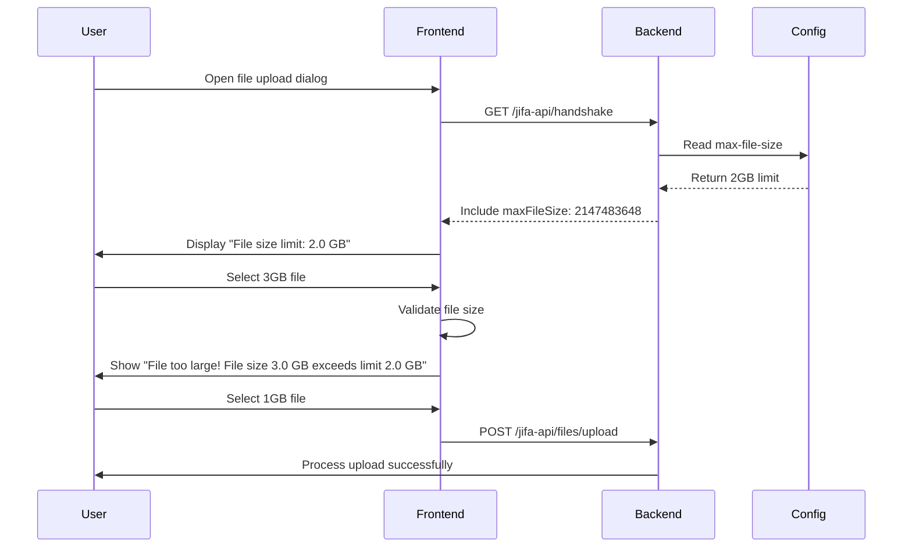

# File Upload Configuration

This guide explains how to configure and manage file upload size limits in Eclipse Jifa.

## Overview

Eclipse Jifa supports dynamic file upload size configuration, providing a seamless experience for both administrators and users. The system automatically synchronizes size limits between the backend configuration and frontend interface, ensuring consistent validation and user-friendly error messages.

## Configuration

### Server Configuration

File upload limits are configured in the `application.yml` file using Spring Boot's multipart configuration:

```yaml
spring:
  servlet:
    multipart:
      max-file-size: 2GB        # Maximum individual file size
      max-request-size: 2GB     # Maximum total request size
```

### Supported Size Formats

You can specify sizes using various units:
- `B` - Bytes
- `KB` - Kilobytes  
- `MB` - Megabytes
- `GB` - Gigabytes

Examples:
```yaml
max-file-size: 512MB
max-file-size: 1GB
max-file-size: 2048MB
max-file-size: 2147483648  # 2GB in bytes
```

## How It Works

### Dynamic Configuration Retrieval

1. **Server Startup**: The backend reads the multipart configuration from `application.yml`
2. **Handshake API**: The configuration is included in the `/jifa-api/handshake` response
3. **Frontend Sync**: The frontend automatically retrieves and stores the configuration
4. **Real-time Updates**: Configuration changes take effect after server restart

### User Experience Flow



## Frontend Integration

### Automatic Limit Display

The upload interface automatically displays the current size limit:

```
┌─────────────────────────────────────┐
│  Drop file here or click to upload │
│                                     │
│  File size limit: 2.0 GB          │
└─────────────────────────────────────┘
```

### Client-Side Validation

Before uploading, the frontend validates file sizes and shows immediate feedback:

```
⚠️ File too large! File size 3.2 GB exceeds limit 2.0 GB
```

### Error Handling

If a large file somehow reaches the server, it returns a structured error response:

```json
{
  "errorCode": "FILE_TOO_LARGE",
  "message": "File size exceeds limit. Actual size: 3.2 GB, Maximum allowed: 2.0 GB"
}
```

## Configuration Examples

### Development Environment (Larger Limits)
```yaml
spring:
  servlet:
    multipart:
      max-file-size: 5GB
      max-request-size: 5GB
```

### Production Environment (Conservative Limits)
```yaml
spring:
  servlet:
    multipart:
      max-file-size: 1GB
      max-request-size: 1GB
```

### Memory-Constrained Environment
```yaml
spring:
  servlet:
    multipart:
      max-file-size: 256MB
      max-request-size: 256MB
```

## Troubleshooting

### Common Issues

**Problem**: Frontend shows old limit after configuration change  
**Solution**: Restart the backend server and refresh the frontend page

**Problem**: Users see "Unknown error" instead of size limit message  
**Solution**: Ensure both `max-file-size` and `max-request-size` are configured

**Problem**: Upload fails even for small files  
**Solution**: Check that `max-request-size` is not smaller than `max-file-size`

### Validation

To verify your configuration is working:

1. **Check the handshake endpoint**:
   ```bash
   curl http://localhost:8102/jifa-api/handshake | jq '.maxFileSize'
   ```

2. **Test with a large file**:
   ```bash
   # Create a test file larger than your limit
   dd if=/dev/zero of=test_large.hprof bs=1M count=3072  # 3GB
   
   # Try uploading via API
   curl -X POST -F "type=HEAP_DUMP" -F "file=@test_large.hprof" \
        http://localhost:8102/jifa-api/files/upload
   ```

3. **Verify frontend display**: Open the upload dialog and confirm the limit is shown correctly

## Best Practices

### Sizing Guidelines

Consider these factors when setting file size limits:

- **Available Memory**: Ensure the server has enough heap memory to process large files
- **Storage Space**: Account for temporary file storage during upload and processing
- **Network Bandwidth**: Larger files take longer to upload
- **User Experience**: Balance functionality with reasonable upload times

### Recommended Limits by File Type

| File Type | Typical Size | Recommended Limit |
|-----------|-------------|-------------------|
| Heap Dumps | 100MB - 8GB | 2GB - 5GB |
| GC Logs | 1MB - 500MB | 1GB |
| Thread Dumps | 1MB - 100MB | 512MB |
| JFR Files | 10MB - 2GB | 2GB |

### Monitoring

Monitor your system for:
- Upload success/failure rates
- Server memory usage during large file processing
- Storage space consumption
- User feedback on upload experience

## Security Considerations

- File size limits help prevent denial-of-service attacks
- Always set reasonable limits based on your infrastructure capacity
- Consider implementing rate limiting for file uploads
- Monitor for unusual upload patterns

## Related Configuration

See also:
- [Server Configuration](./configuration.md) - Complete server configuration reference
- [Deployment Guide](./deployment.md) - Production deployment considerations
- [Getting Started](./getting-started.md) - Initial setup instructions