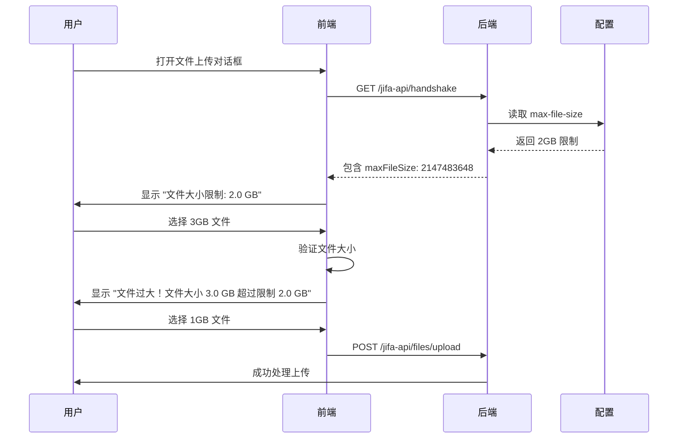

# 文件上传配置

本指南介绍如何在 Eclipse Jifa 中配置和管理文件上传大小限制。

## 概述

Eclipse Jifa 支持动态文件上传大小配置，为管理员和用户提供无缝体验。系统自动在后端配置和前端界面之间同步大小限制，确保一致的验证和用户友好的错误消息。

## 配置方法

### 服务器配置

文件上传限制在 `application.yml` 文件中使用 Spring Boot 的 multipart 配置进行设置：

```yaml
spring:
  servlet:
    multipart:
      max-file-size: 2GB        # 单个文件最大大小
      max-request-size: 2GB     # 请求总大小上限  
```

### 支持的大小格式

您可以使用各种单位指定大小：
- `B` - 字节
- `KB` - 千字节
- `MB` - 兆字节  
- `GB` - 千兆字节

示例：
```yaml
max-file-size: 512MB
max-file-size: 1GB
max-file-size: 2048MB
max-file-size: 2147483648  # 2GB（以字节为单位）
```

## 工作原理

### 动态配置获取

1. **服务器启动**：后端从 `application.yml` 读取 multipart 配置
2. **握手 API**：配置包含在 `/jifa-api/handshake` 响应中
3. **前端同步**：前端自动检索并存储配置
4. **实时更新**：配置更改在服务器重启后生效

### 用户体验流程



## 前端集成

### 自动限制显示

上传界面自动显示当前大小限制：

```
┌─────────────────────────────────────┐
│  拖拽文件至此处或点击进行上传          │
│                                     │
│  文件大小限制：2.0 GB               │
└─────────────────────────────────────┘
```

### 客户端验证

上传前，前端验证文件大小并显示即时反馈：

```
⚠️ 文件过大！文件大小 3.2 GB 超过限制 2.0 GB
```

### 错误处理

如果大文件意外到达服务器，会返回结构化错误响应：

```json
{
  "errorCode": "FILE_TOO_LARGE", 
  "message": "文件大小超过限制。实际大小: 3.2 GB，最大允许大小: 2.0 GB"
}
```

## 配置示例

### 开发环境（较大限制）
```yaml
spring:
  servlet:
    multipart:
      max-file-size: 5GB
      max-request-size: 5GB
```

### 生产环境（保守限制）
```yaml
spring:
  servlet:
    multipart:
      max-file-size: 1GB
      max-request-size: 1GB
```

### 内存受限环境
```yaml
spring:
  servlet:
    multipart:
      max-file-size: 256MB
      max-request-size: 256MB
```

## 故障排除

### 常见问题

**问题**：配置更改后前端显示旧限制  
**解决**：重启后端服务器并刷新前端页面

**问题**：用户看到"未知错误"而不是大小限制消息  
**解决**：确保 `max-file-size` 和 `max-request-size` 都已配置

**问题**：即使小文件也上传失败  
**解决**：检查 `max-request-size` 不小于 `max-file-size`

### 验证

要验证配置是否工作：

1. **检查握手端点**：
   ```bash
   curl http://localhost:8102/jifa-api/handshake | jq '.maxFileSize'
   ```

2. **用大文件测试**：
   ```bash
   # 创建大于限制的测试文件
   dd if=/dev/zero of=test_large.hprof bs=1M count=3072  # 3GB
   
   # 尝试通过 API 上传
   curl -X POST -F "type=HEAP_DUMP" -F "file=@test_large.hprof" \
        http://localhost:8102/jifa-api/files/upload
   ```

3. **验证前端显示**：打开上传对话框并确认限制显示正确

## 最佳实践

### 大小指导原则

设置文件大小限制时考虑这些因素：

- **可用内存**：确保服务器有足够的堆内存处理大文件
- **存储空间**：考虑上传和处理期间的临时文件存储
- **网络带宽**：较大文件需要更长的上传时间
- **用户体验**：在功能性和合理上传时间之间平衡

### 按文件类型推荐的限制

| 文件类型 | 典型大小 | 推荐限制 |
|----------|----------|----------|
| 堆转储 | 100MB - 8GB | 2GB - 5GB |
| GC 日志 | 1MB - 500MB | 1GB |
| 线程转储 | 1MB - 100MB | 512MB |
| JFR 文件 | 10MB - 2GB | 2GB |

### 监控

监控您的系统：
- 上传成功/失败率
- 大文件处理期间的服务器内存使用
- 存储空间消耗
- 用户对上传体验的反馈

## 安全考虑

- 文件大小限制有助于防止拒绝服务攻击
- 始终根据基础设施容量设置合理限制
- 考虑对文件上传实施速率限制
- 监控异常上传模式

## 相关配置

另请参阅：
- [服务器配置](./configuration.md) - 完整的服务器配置参考
- [部署指南](./deployment.md) - 生产部署注意事项
- [快速入门](./getting-started.md) - 初始设置说明